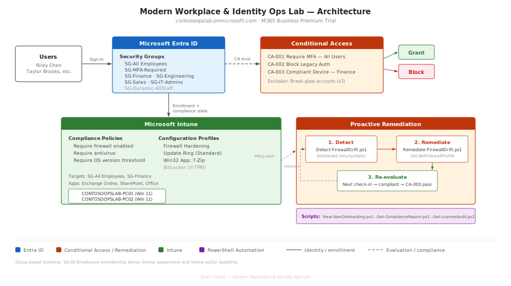

# Modern Workplace & Identity Ops Lab (Microsoft 365 / Entra ID / Intune)

A hands-on lab that simulates day-to-day Microsoft 365 identity + endpoint operations for a small organization. Built to demonstrate practical skills in **Entra ID (Conditional Access, groups, RBAC)**, **Intune (enrollment, compliance, configuration, app deployment)**, **monitoring**, and **PowerShell automation (Microsoft Graph)**.

---

## Architecture (1-page overview)

---

## Quick proof (clickable)
- **Licenses available**: [`01-tenant-licenses.png`](docs/screenshots/01-tenant-licenses.png)
- **Devices enrolled in Intune**: [`11-enrolled-devices.png`](docs/screenshots/11-enrolled-devices.png)
- **Win32 app deployment (7-Zip) + reporting**: [`16-app-deployment.png`](docs/screenshots/16-app-deployment.png)
- **Proactive Remediation evidence (Firewall drift detection/remediation)**: [`26-remediation-status.png`](docs/screenshots/26-remediation-status.png)

---

## What’s implemented

### 1) Identity & Access (Entra ID)
- Department and functional security groups (e.g., `SG-Engineering`, `SG-Finance`, `SG-MFA-Required`, `SG-All-Employees`)
- Conditional Access baselines:
  - **CA-001** Require MFA for users (scoped via groups)
  - **CA-002** Block legacy authentication
  - **CA-003** Require compliant device for Finance access (device compliance signal from Intune)
- Break-glass emergency access accounts (2 accounts) with documented controls + exclusions from CA policies

**Runbook:** [`runbooks/break-glass-procedure.md`](runbooks/break-glass-procedure.md)

---

### 2) Endpoint Management (Intune)
- Windows endpoints enrolled and managed by Intune (Windows 11 VMs)
- Compliance policy baseline (password + Defender + firewall + platform requirements)
- Configuration profiles:
  - Firewall hardening profile
  - BitLocker / device encryption policy (documented VM/TPM limitations where applicable)
  - Update rings (pilot vs standard approach where applicable)
- Application deployment:
  - Win32 app (7-Zip packaged as `.intunewin`)
  - PowerShell platform script (registry baseline marker)

---

### 3) Automated operations control (Proactive Remediations)
Implements a full “detect → remediate → report” loop:
- Detection: checks if any firewall profile is disabled
- Remediation: re-enables firewall profiles and validates
- Intune reporting provides device status and last run outcomes

Scripts:
- [`scripts/remediation/Detect-FirewallDrift.ps1`](scripts/remediation/Detect-FirewallDrift.ps1)
- [`scripts/remediation/Remediate-FirewallDrift.ps1`](scripts/remediation/Remediate-FirewallDrift.ps1)

---

### 4) Monitoring & troubleshooting write-ups
Ticket-style incident documentation demonstrating investigation workflow:
- Identity / Conditional Access sign-in issue
- Endpoint app deployment troubleshooting scenario
- Enrollment / device management troubleshooting scenario

**Write-ups:** [`docs/investigation-writeups.md`](docs/investigation-writeups.md)

---

### 5) PowerShell automation (Microsoft Graph)
Automation scripts used for identity + ops reporting:
- [`scripts/New-UserOnboarding.ps1`](scripts/New-UserOnboarding.ps1) — creates user, assigns groups (department + all employees + MFA-required)
- [`scripts/Get-ComplianceReport.ps1`](scripts/Get-ComplianceReport.ps1) — exports device compliance state to CSV
- [`scripts/Get-LicenseAudit.ps1`](scripts/Get-LicenseAudit.ps1) — audits license pool + flags unlicensed users
- Graph scopes + production notes: [`scripts/README.md`](scripts/README.md)

---

## Notes on implementation (differences vs “ideal” production)
- **Lab tenant licensing**: implemented using available tenant licensing (see screenshot proof).  
- **Endpoints**: Windows 11 endpoints are **VirtualBox VMs** enrolled into Intune (realistic for lab validation).
- **BitLocker / encryption**: VM hardware/TPM limitations may affect whether encryption fully enables; configuration + reporting evidence is included, and limitations are documented where observed.
- **Conditional Access testing**: CA validation is shown via sign-in events and policy results; test policies may be created temporarily to generate clean failure evidence.

---

## Repo structure
- `docs/` → screenshots, diagrams, investigation write-ups  
- `runbooks/` → operational runbooks (break-glass, CA troubleshooting, enrollment troubleshooting, etc.)  
- `scripts/` → Graph + Intune automation scripts  
- `scripts/remediation/` → proactive remediation detection/remediation pair

---

## Screenshots index
All redacted screenshots live in: [`docs/screenshots/`](docs/screenshots/)
