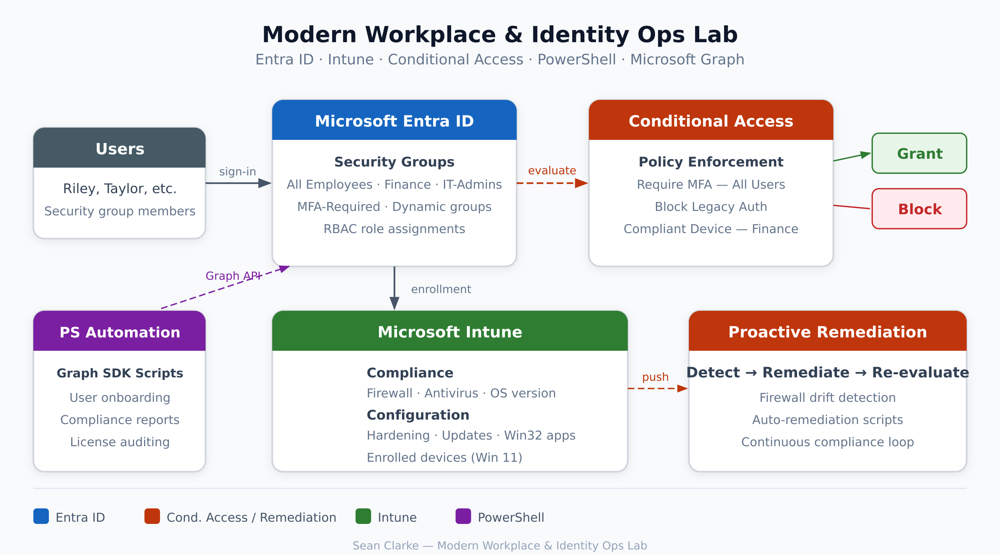

# Modern Workplace & Identity Ops Lab (ContosoOpsLab)

## Overview
A hands-on lab that simulates real-world Microsoft 365 identity + endpoint operations for a small organization. Built to demonstrate day‑one skills for junior SysAdmin / Cloud Ops roles: Entra ID identity administration, Conditional Access security baselines, Intune endpoint management, monitoring, and PowerShell automation.

## Environment
- **Tenant:** Microsoft 365 Developer tenant (E5 Developer / equivalent SKU)
- **Identity:** Microsoft Entra ID (Entra admin center)
- **Endpoint management:** Microsoft Intune admin center
- **Endpoints:** 2x Windows 11 Enterprise Evaluation VMs (VirtualBox on Windows 11 Home)
- **Users:** Department-based users + security groups; dynamic group for “all staff”
- **Security:** Conditional Access (MFA, legacy auth block, compliant device for finance), break-glass accounts
- **Automation:** Microsoft Graph PowerShell SDK scripts for onboarding and reporting

## Architecture

**Core design pattern used throughout:**
1. **Users → Groups** (department + baseline groups)
2. **Groups → Licenses / CA targeting / Intune targeting**
3. **Policies → Compliance evaluation → Remediation (drift detection + auto-fix)**

## What I Built

### Identity & Access (Entra ID)
- Created **security groups** used for licensing, policy targeting, and segmentation:
  - SG-All-Employees, SG-IT-Admins, SG-Engineering, SG-Sales, SG-Finance
  - SG-Intune-Devices (device targeting placeholder)
  - SG-MFA-Required (Conditional Access targeting)
- Created a **dynamic user group**:
  - `SG-Dynamic-AllStaff` using rule:
    - `(user.department -ne null) and (user.accountEnabled -eq true)`
- Configured **least privilege** role assignment:
  - Jordan Lee: **Intune Administrator**
  - Standard users: **no admin roles**
- Implemented **2 break-glass accounts** and documented a full runbook:
  - `runbooks/break-glass-procedure.md`

### Security (Conditional Access)
- **CA-001:** Require MFA for all users (group-targeted)
- **CA-002:** Block legacy authentication clients
- **CA-003:** Require compliant device for Finance apps (**Report-only** initially)
- Created a temporary test policy during troubleshooting to generate a clear CA failure event:
  - Example: `CA-TEST-001: Block Browser Sign-in (test)` (used to capture sign-in log evidence)

### Endpoint Management (Intune)
- Configured **Automatic Enrollment** for Windows using **MDM user scope** targeting SG-All-Employees
- Enrolled two Windows 11 VMs into Intune and verified:
  - Devices appear under **Devices → All devices**
- Compliance + configuration:
  - **Compliance policy**: Windows baseline (password, firewall/defender, Secure Boot, BitLocker requirement noted)
  - **Firewall hardening profile** (Settings catalog)
  - **BitLocker profile**
    - Note: VM/vTPM limitations may prevent full encryption enforcement; policy configuration still demonstrates the workflow
  - **Windows Update rings**
    - Implemented Standard ring; IT Pilot ring also created (staged rollout pattern)
- App + script deployment:
  - Packaged and deployed **7‑Zip** as a Win32 app
  - Deployed a **PowerShell platform script** that writes a registry baseline key
- **Proactive Remediation**:
  - Deployed Detect/Remediate pair to detect firewall drift and auto-re-enable firewall

### Monitoring & Troubleshooting
- Created ticket-style investigation writeups:
  - `docs/investigation-writeups.md`
- Produced reporting screenshots (compliance summary, device configuration status, remediation status)

### Automation (PowerShell + Microsoft Graph)
- `scripts/New-UserOnboarding.ps1` — creates users and adds them to the required groups
- `scripts/Get-ComplianceReport.ps1` — exports Intune device compliance to CSV
- `scripts/Get-LicenseAudit.ps1` — audits license consumption and flags unlicensed users
- `scripts/remediation/*` — proactive remediation scripts
- See `scripts/README.md` for Graph scopes + production notes

## Implementation Notes (Accuracy / Deviations from Original Plan)
This lab followed a “build guide” plan, but a few practical adjustments were made during implementation:

- **Virtualization:** Host OS is **Windows 11 Home**, so **Hyper‑V was not available**. Endpoints were built using **Oracle VirtualBox** instead.
- **Windows ISO / OOBE:** Windows 11 Enterprise Evaluation ISO was used for VM installs. Some VM boot issues occurred when disk space was low or the ISO path changed; resolved by restoring the ISO and freeing disk space.
- **Licensing:** Licenses were initially assigned per-user during user creation, then the lab standardized on **group-based licensing** via `SG-All-Employees`.
- **BitLocker encryption settings:** “XTS‑AES 256” selection was not presented in the minimal BitLocker CSP picker. Encryption method settings were configured under Administrative Templates BitLocker settings where available. VM/vTPM limitations were documented.
- **Update ring conflicts:** A conflict can appear if both “Standard” and “IT Pilot” rings target the same device. The intended approach is staged rollout targeting (Pilot → SG‑IT‑Admins, Standard → SG‑All‑Employees) with no overlap.
- **Conditional Access evidence:** Some client-app scenarios did not reliably generate the intended CA failure evidence in logs. A dedicated **CA test policy** was temporarily used to produce an unambiguous blocked sign-in event for documentation.
- **Remediation scheduling:** Proactive Remediation reporting and execution cadence can lag in the portal. Evidence was captured once device status populated and “issue fixed/without issues” states appeared.

## Repo Contents
- `docs/screenshots/` — evidence screenshots (names align to the build steps)
- `docs/investigation-writeups.md` — incident-style investigations
- `runbooks/` — operational procedures (break-glass + troubleshooting)
- `scripts/` — automation scripts and permissions notes
- `scripts/remediation/` — proactive remediation scripts

## Screenshots
See `docs/screenshots/` for step-by-step evidence, including:
- Conditional Access policy configuration + sign-in log evidence
- Intune enrolled devices and compliance status
- Configuration profile deployment status
- App deployment status (7-Zip) and platform script assignment
- Remediation status (device status + overview)
